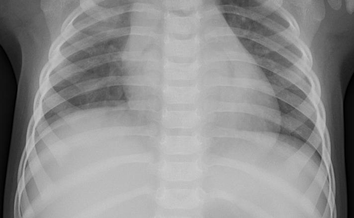

# Pneumonia-demo

Este es un repositorio demo de clasificación de imagenes radiograficas para detección de neumonia

## El problema

En la actualidad el tiempo requerido por un especialista para realizar analisis
de una radiografía para identificar neumonia es de 20 minutos.
Aunque considerando la carga de trabajo y el hecho de que los pacientes
deberan agendar cita hasta tener un resultado (por lo menos en Mexico asi es),
este tiempo aumenta y en los casos donde el resultado es positivo,
este tiempo puede significar la posibilidad de salvar una vida.

El tiempo medio desde los primeros síntomas
hasta el inicio de la disnea es de 5-8 días.
Esto sumado con el tiempo de atención, toma y entrega de resultados se puede elevar con facilidad a mas de 15 días.
En este tiempo el paciente podria empezar a presentar falla organica.

## La propuesta

Por lo descrito en la sección anterior se pretende generar un sistema de consulta rapida que advierta a los medicos
desde la toma de radiografía que no se limite a informar entre Normal y Neumonia.

## Objetivos

## Metodología
### Los datos utilizados

Los datos utilizados para este entrenamiento han sido de solo 600 imagenes clasificadas como Norma, Bacteria y Virus.
Se procuró que la cantidad de datos estuviera balanceada entre las  tres categorías.

### Procesamiento

Con la intención de estandarizar los datos a usar se eligió que las dimensiones de entrada de la red fueran un valor cercano al promedio y que fuera una resolución conocida.
Para lograr esto se relleno el espacio faltante en cada imagen con la intención de convertirla en un cuadro a la vez que las imagenes de menores dimensiones se llenaban hasta los 1024 x 1024 pixeles.

Las imagenes de mayores dimensiones se reescalan para quedar en las dimensiones descritas.

### Ecualización de imagenes

La siguiente imagen es una muestra del set de datos, esta puede estar un poco borrosa o con bajo contraste debido a las diferentes maquinas que pueden ser usadas para la toma de rediografía.

En seguida tenemos la misma imagen pero esta ha sido tratada con la funcion CLAHE de opencv para ecualizar su histograma.

### Red Neuronal Convolucional (CNN)

* 3 capas convolucionales
* 3 capas de reducción de dimensionalidad
* 1 capa de aplanado
* 1 capa densa
* 1 capa de salida de categorias

## Resultados

### Graficas de evolución del entrenamiento

Se puede observar en la evolución del entrenamiento que la precisión y la perdida del modelo cambian de una manera
constante mejorando hasta cerca de la epoca 15 y a partir de ahi se mantiene casi identica.

### Matriz de confusión

Podemos observar que los resultados de la prediccion de las 180 imagenes de este set de pruebas
son buenos a pesar de haberse realizado solo con 600 imagenes, tenemos que solo se predicen como normales 2 imagenes que en realidad son virus lo cual es bueno ya que no se dejaría de prestar atención a los pacientes enfermos.

## Futuro (ToDo)

Siguientes fases:

* Pruebas de augmentación de datos en un entrenamiento.
* Reentrenar con los datos restantes por partes.
* Mejorar la API para introducir lotes de imagenes.

Gracias a todos por su atención :pray:

## Correr la demo

Para correr una demo de streamlit es necesario realizar los siguientes pasos:

* Clonar el repositorio
* Instalar los requeriments.txt
* Guardar los pesos del modelo en un directorio ubicado al mismo nivel que el archivo demo.py, la estructura debe ser "pesos/model.h5"
* Correr con "streamlit run demo.py"
